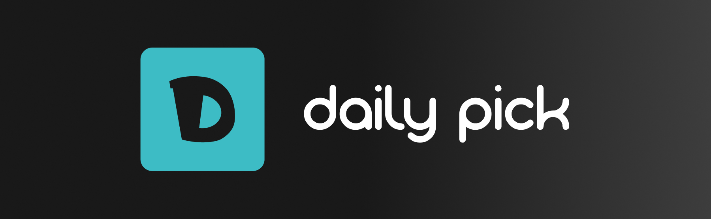

Make **turns** among your team mates for a **daily** task. 🚀  
_A FOSS solution to your Slack team_

## Basic overview

This a FOSS (free and open-source) Slack application template, which means you can freely fork and distribute the way you desire. Please add a reference to this project if you would like to use it 💕:star:.

By configuring this application and creating your own instance, you will be add this as a Slack application and allow to your any member of your team to know if it is his/her time to make a task, e.g. moderate a daily meeting (Scrum).

**Main feature:** add a **name** for your schedule, add **participants**, set a **time** for each day of the week. **Done!** At the time you set, a Slack bot will send a message on the channel you created the schedule 📅.

## Motivation

There are similar apps available on Slack marketplace, but all of those have pricing and other limitations that discourage their usage by me and my team. So I decided to create this template to make it easy to set up on any environment you want.

Also this is a technical and personal use case of some technologies I'd like to test: Google Firebase, Digital Ocean and Google Cloud Platform. Along with Typescript on Node.js.

## Features

- [x] 📅 A modal to pick users and define when the message will be sent.
- [x] 📣 Isolate schedules per Slack channel.
- [x] 👀 List all schedules created on a Slack channel.
- [x] 🗑 Remove a schedule from the list.
- [x] 🐋 Dockerfile

### Coming up

- SQLite 3 support (alternative support to firebase).
- Skip feature, when the participant is not available to join.

### Future

- [ ] Configurable timezone
- [ ] Multi-languages (currently, only pt-BR is available)

## Configuration

Before proceeding, it is important to mention that some few choices below could include extra costs 💸, out of the scope of this project - thus be careful and wise on your tools choice.

Each section below has a badge to inform about the related pricing possibility.

### Hosting

You need to provide a public URL to the application. Only public URLs are visible to the Slack environment. You can use any hosting service you desire. Suggestions: Google Cloud Platform ([Cloud Run](https://cloud.google.com/run/), [App Engine](https://cloud.google.com/appengine/)), [Digital Ocean](https://www.digitalocean.com/products/app-platform/), etc.

After you get a public URL, you will paste it following the below way:

- On `Interactivity & Shortcuts` you will add your url like this: `https://my-public-url.com/api/commands/daily/act`.
- On `Slash Commands` you will add a new command (suggestion: `/daily`) and set the url like this: `https://my-public-url.com/api/commands/daily/pick`

**Note:** Replace https://my-public-url.com for your public HTTPs url.

#### Requirements

- The server you choose must to be able to keep **itself always online**.
- The public address must be HTTPS.

#### Pricing

It is totally related to your hosting service. There are plenty of cloud services that provide the kind of infrastructure this app need, most of them are paid but a few are conditionally free. Make sure to do your best choice here.

Please check how this app behaves on your infrastructure to decide how much memory and CPU this app will need. It is totally related to how much it will be used by your team.

### Slack

You need to create a private Slack application. Follow [this resource](https://api.slack.com/apps?new_app=1) to make it happen. After creating an application, look for to the following features: `Interactivity & Shortcuts` and `Slash Commands` - those will be used to configure how your instance will be served (see [Hosting](#Hosting)).

The following environment variables are required and must be defined on your side:

| Variable             | Located at                                                             |
| -------------------- | ---------------------------------------------------------------------- |
| SLACK_SIGNING_SECRET | `Settings` > `Basic Information` > `App Credentials`                   |
| SLACK_APP_TOKEN      | `Settings` > `Basic Information` > `App-Level Tokens`                  |
| SLACK_BOT_TOKEN      | `Settings` > `OAuth & Permissions` > `OAuth Tokens for Your Workspace` |

#### Pricing

This is totally free and does not have any costs associated so far.

### Database

A opinionated database choice was made here, because [Google Firebase](https://firebase.google.com/) is the only database supported by this project.

The following environment variables are required and must be defined on your side:

| Variable        | Located at                                                               | Instructions                                                                                                                         |
| --------------- | ------------------------------------------------------------------------ | ------------------------------------------------------------------------------------------------------------------------------------ |
| FIREBASE_CONFIG | ⚙ > `Project settings` > `Service Account` > `Generate new private key`. | When you click on the button, a JSON file will be downloaded. Use any way you prefer to convert that private key to a Base64 string. |

#### Pricing

[Google Firebase](https://firebase.google.com/) charges according to the usage of their resource. If your company is small, this may fit for you because so far it is free for lightweight usage. Read carefully all pricing instructions to make it work for you.

### Sentry

This is an optional step, you can skip it if you don't want it.

Sentry is a platform to keep track of all error that happen on your backend instance.

The following environment variables are required and must be defined on your side:

| Variable   | Instructions                                                                |
| ---------- | --------------------------------------------------------------------------- |
| SENTRY_DSN | https://docs.sentry.io/product/sentry-basics/dsn-explainer/#dsn-utilization |

### Done!

Your application is available to use. You can test it by running the Slash command you created previously, e.g. `/daily`. If your application was successfully created, the bot will sent you a message containing the instructions to use the bot.

Good job. 🚀
